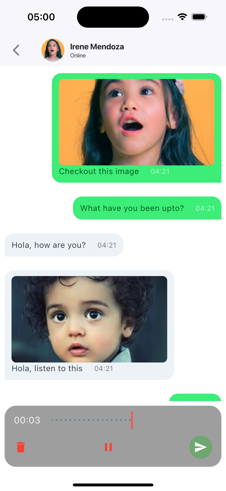
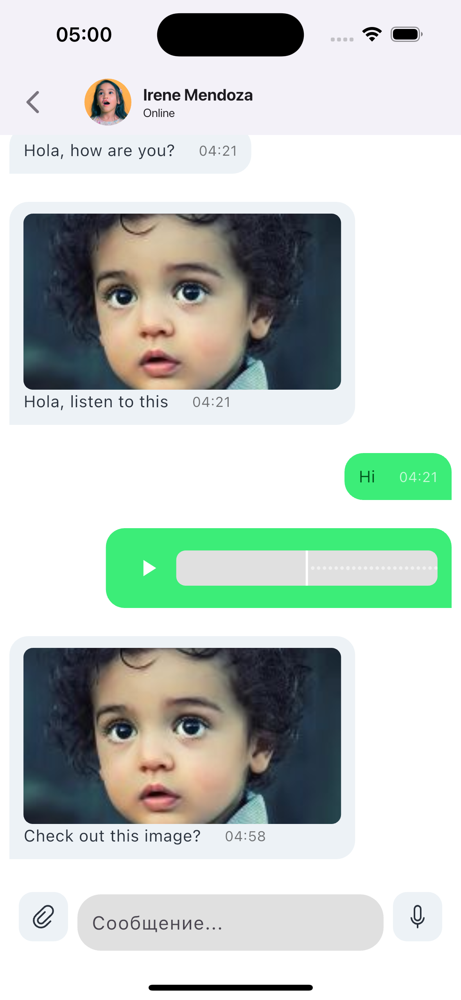

# Buzz Chat Application

Buzz is a feature-rich chat application built with Flutter. It allows users to send text messages, images, videos, audio recordings, and files. The app also supports real-time messaging, message replies, and notifications.

## Features

- **Real-Time Messaging(Simulated)**: Send and receive messages instantly.
- **Media Sharing**: Share images, videos, audio recordings, and files.
- **Message Replies**: Reply to specific messages in a chat.
- **Notifications**: Receive notifications for new messages.
- **Audio Recording**: Record and send audio messages.
- **Cross-Platform**: Works on both Android and iOS.


### 📸 Screenshots

#### Chat List Screen


#### Chat Screen





## Technologies Used

- **Flutter**: The framework used to build the app.
- **Hive**: A lightweight and fast NoSQL database for local storage.
- **Audio Waveforms**: A package for recording and visualizing audio waveforms.
- **Image Picker**: A package for selecting images and videos from the gallery.
- **File Picker**: A package for selecting files from the device.
- **Permission Handler**: A package for handling runtime permissions.
- **Flutter Local Notifications**: A package for displaying local notifications.

---

## Getting Started

Follow these steps to set up and run the Buzz Chat Application on your local machine.

### Prerequisites

- **Flutter SDK**: Ensure you have Flutter installed. If not, follow the [official Flutter installation guide](https://flutter.dev/docs/get-started/install).
- **Android Studio/Xcode**: For running the app on Android/iOS emulators or physical devices.
- **Dependencies**: Install the required dependencies by running `flutter pub get`.

---

### Installation

1. **Clone the Repository**:
   ```bash
   git clone https://github.com/mubiyn/buzz-chat-app.git
   cd buzz-chat-app
   ```

2. **Install Dependencies**:
   ```bash
   flutter pub get
   ```

---

### Running the App

#### Android

1. **Connect an Android Device**:
   - Connect your Android device via USB or start an Android emulator.

2. **Run the App**:
   ```bash
   flutter run
   ```

3. **Grant Permissions**:
   - Allow microphone and storage permissions when prompted.

#### iOS

1. **Connect an iOS Device**:
   - Connect your iOS device via USB or start an iOS simulator.

2. **Run the App**:
   ```bash
   flutter run
   ```

3. **Grant Permissions**:
   - Allow microphone and photo library permissions when prompted.

---

### Project Structure

```
lib/
├── main.dart                # Entry point of the application
├── features/
│   ├── chat/                # Chat-related features
│   │   ├── data/            # Data layer (e.g., repositories, models)
│   │   ├── domain/          # Domain layer (e.g., use cases, entities)
│   │   ├── presentation/    # Presentation layer (e.g., screens, widgets)
│   │   └── provider/        # State management (e.g., providers, viewmodels)
├── core/                    # Core functionality (e.g., assets, constants)
└── widgets/                 # Reusable widgets
```

---

### Dependencies

Here are the key dependencies used in the project:

- **Hive**: For local storage.
- **Audio Waveforms**: For recording and visualizing audio.
- **Image Picker**: For selecting images and videos.
- **File Picker**: For selecting files.
- **Permission Handler**: For handling runtime permissions.
- **Flutter Local Notifications**: For displaying notifications.

You can find the full list of dependencies in the `pubspec.yaml` file.

---

### Troubleshooting

#### 1. **Audio Recording Not Working**
   - Ensure microphone permissions are granted.
   - Check if the audio session is properly configured.
   - Verify that the file path is valid and writable.

#### 2. **Media Sharing Not Working**
   - Ensure storage permissions are granted.
   - Check if the file picker and image picker are properly configured.

#### 3. **Notifications Not Showing**
   - Ensure notification permissions are granted.
   - Check if the `flutter_local_notifications` package is properly configured.


### License

This project is licensed under the MIT License. See the [LICENSE](LICENSE) file for details.

---

### Acknowledgments

- **Flutter Team**: For the amazing framework.
- **Hive Team**: For the lightweight and fast NoSQL database.
- **Audio Waveforms Team**: For the audio recording and visualization package.

---

### Contact

For any questions or feedback, feel free to reach out:

- **Email**: don'tbother.com
- **GitHub**: [mubiyn](https://github.com/mubiyn)

